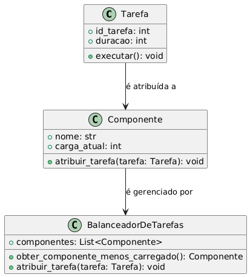

# Como rodar o projeto

Executar o comando para entrar no ambiente virtual:

```bash
source venv/bin/activate
```

Executar o comando para rodar o projeto:

```bash
python3 main.py
```

# Sobre o projeto

## Descrição do Problema
Em sistemas que possuem múltiplos serviços ou componentes responsáveis por executar tarefas, pode ocorrer sobrecarga em um serviço enquanto outros permanecem ociosos. É necessário um mecanismo para distribuir as tarefas de maneira equilibrada.

## Descrição da Solução
O padrão "Pattern Balancer" define um intermediário que gerencia a fila de tarefas e distribui dinamicamente essas tarefas entre serviços ou componentes disponíveis. O balanceamento é baseado em critérios como carga atual, capacidade ou prioridade de cada componente.

## Diagrama de Classes

